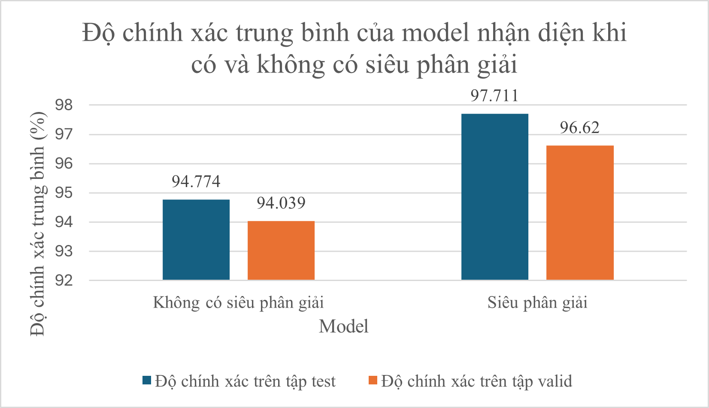

# 🔥 WildFire Detection with Super-Resolution Enhancement

## 📌 Mục tiêu
Nghiên cứu và đánh giá hiệu quả của mô hình siêu phân giải trong việc cải thiện độ chính xác của mô hình nhận diện cháy rừng từ ảnh vệ tinh hoặc ảnh chụp từ xa.

---

## 🔄 Quy trình thực hiện

### ✅ Bước 1: Lựa chọn mô hình nhận diện cháy rừng
- Chọn mô hình học sâu phù hợp để phát hiện cháy rừng, ví dụ: CNN, ResNet, hoặc EfficientNet.
- Đảm bảo khả năng huấn luyện trên tập ảnh có gán nhãn cháy / không cháy.

### ✅ Bước 2: Lựa chọn mô hình siêu phân giải ảnh
- Chọn một mô hình tăng cường độ phân giải ảnh như:
  - SRCNN
  - EDSR
  - Real-ESRGAN
- Mục tiêu: cải thiện độ nét và chi tiết vùng cháy tiềm năng.

### ✅ Bước 3: Huấn luyện mô hình nhận diện cháy rừng **(không dùng siêu phân giải)**
- Sử dụng ảnh gốc (low-resolution)
- Huấn luyện và lưu lại độ chính xác làm baseline

### ✅ Bước 4: Huấn luyện mô hình nhận diện cháy rừng **(kết hợp với siêu phân giải)**
- Dùng mô hình siêu phân giải để xử lý ảnh đầu vào
- Sau đó huấn luyện lại mô hình phát hiện cháy rừng
- So sánh hiệu quả với bước 3

### ✅ Bước 5: Đánh giá và so sánh độ chính xác
- So sánh độ chính xác mô hình nhận diện cháy rừng:
  - Trước và sau khi sử dụng ảnh được cải tiến bởi mô hình siêu phân giải
- Có thể sử dụng các chỉ số: Accuracy, Precision, Recall, F1-score

---

